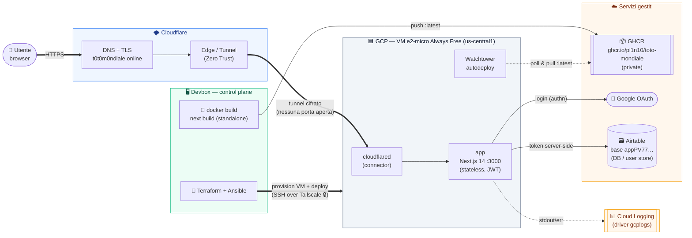

# Architettura — Toto Mondiale

Dove buildiamo, per dove passa il traffico, dove gira, cosa esponiamo.

## Come leggerlo — le 3 catene

### 1. Build & deploy (dalla devbox)

- La **devbox** builda l'immagine (la e2-micro andrebbe OOM su `next build`)
  e la **pusha su GHCR** come `:latest`.
- **Terraform** crea la VM, **Ansible** la configura e avvia lo stack — tutto
  via **SSH over Tailscale** (nessuna porta SSH pubblica).
- **Watchtower** sulla VM fa poll di GHCR e ri-pulla `:latest` da solo →
  autodeploy ad ogni nuova immagine.

### 2. Ingress pubblico (cosa esponiamo)

- Utente → **HTTPS** su `t0t0m0ndlale.online` → **Cloudflare** (DNS + TLS) →
  **Tunnel cifrato** → container `cloudflared` → `app:3000`.
- Punto chiave: **la VM non ha NESSUNA porta aperta**. Il traffico entra solo
  "tirato dentro" dal tunnel. Niente IP pubblico esposto, niente firewall
  ingress.

### 3. Dipendenze runtime (server-side)

- `app` → **Airtable** col token che **resta sul server** (mai al client).
- `app` → **Google OAuth** per il login (poi sessione **JWT, stateless** →
  niente DB sulla VM).
- `app` → **Cloud Logging** via driver `gcplogs` (log senza agent, leggibili
  dalla devbox con `infra/scripts/tlogs`).

## In una riga

Buildiamo sulla **devbox** → distribuiamo su **GHCR** → gira su una **VM GCP
Always Free** → esponiamo solo via **Cloudflare Tunnel** (zero porte aperte),
con **Airtable** come DB e **Google** per il login.
